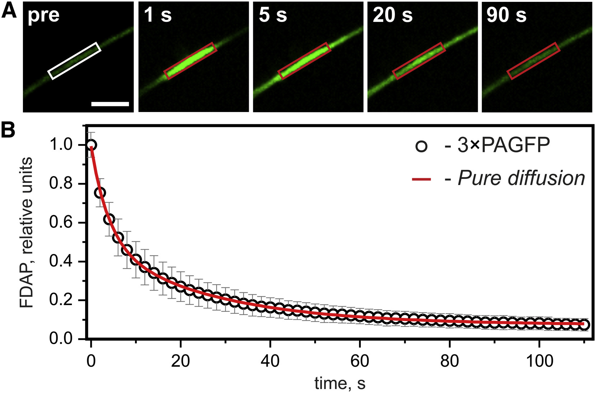

cFDAP v.0.1.0
=============

cFDAP is a command-line Linux tool for fitting FRAP/FDAP curves.

The overall goal of cFDAP is to provide a fast and robust way to extract kinetic parameters from FRAP/FDAP curves gathered from outgrowths of living neuronal cells. Nevetheless, the code can be relatively simply adapted to any experiment outline, which, in turn, requires theoretical expressions for `FRAP(t)` or `FDAP(t)` signals be hardcoded explicitly (please read [Igaev et al. (2014) Biophys. J. 107: 2567-2578](https://doi.org/10.1016/j.bpj.2014.09.016) for more details and cite it when using the code).

<div align="center">
  
</div>

New
===

 * 30.08.2016

    A new option "-w" has been introduced which allows the user to choose between weighted and unweighted fitting.

 * 09.02.2016

    GSL 2.0 support has been implemented.

 * 13.09.2015

    Several bugs have been fixed. From now on, cFDAP and curve/error files must be located in the same folder.

 * 12.08.2015

    cFDAP now supports kinetic models with 1 and 2 fit parameters and calculates 95%, 97.5% and 99.9% confidence intervals.

Requirements
============

To successfully compile cFDAP, you need to install the [GNU Scientific Library](http://www.gnu.org/software/gsl/). For Ubuntu/Debian, one needs to install gsl-bin (binary package), libgsl2 (library package) and, optionally, libgsl-dev (development package).

Compilation
===========

 ```
 cc cFDAP.c -o cFDAP -lgsl -lgslcblas -lm
 ```

Usage
=====

 To get quick start just run
 ```
 ./cFDAP
 ```

Copying
======

cFDAP is licensed under a GPL license. That means that distributing the code is only allowed under the same terms. 

